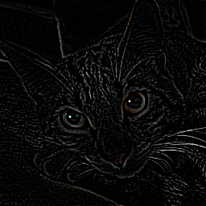
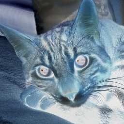

# Kernel Image Processor (for PNM images)

This program implements [Kernel Image Processing](https://en.wikipedia.org/wiki/Kernel_(image_processing)) for images with [PNM formats](https://en.wikipedia.org/wiki/Netpbm) (.pbm, .pgm, .ppm), in plain or in bytes encoding.\
The program supports image with 8 and 16 bit depth (bits per channel).
It can also apply other effects like grayscaling, inverting color, changing brightness and cropping.

## Functionality

The user can interact with the program via command-line:
```
Main Arguments:
-i <input_file>         : Specify input file path
-o <output_file>        : Specify output file path (encoded as bytes)
-op <output_file>       : Specify output file path (encoded as plain ascii)

Convolution effects:
-sharpen                : Apply sharpening effect
-blur                   : Apply Gaussian blur effect
-edge                   : Apply "edge detection" effect
-emboss                 : Apply embossing effect

Other effects:
-brightness <factor>    : Change brightness by the given factor
-crop <coordinates>     : Crop the image with comma-separated coordinates for the vertices: "x0,y0,x1,y1"
-invert                 : Invert the colors of the image
-grayscale              : Convert the image to grayscale

Other commands:
-v                      : Enable verbose output for debugging information
-h                      : Show this help message
```

The program loads a provided input file, applies the selected effect and saves it to a provided output file path.

## Limitations

- The program loads PBM images as grayscale (PGM) so it will save them as .pgm images
- It is not possible to specify a custom kernel via the command-line interface

## Examples

### Original


### Sharpening
```bash
KernelImageProcessor.exe -i "original.ppm" -sharpen -o "sharpen.ppm"
```


### Edge detection effect
```bash
KernelImageProcessor.exe -i "original.ppm" -edge -o "sharpen.ppm"
```


### Embossing
```bash
KernelImageProcessor.exe -i "original.ppm" -emboss -o "sharpen.ppm"
```


### Gaussian Blur
```bash
KernelImageProcessor.exe -i "original.ppm" -blur -o "sharpen.ppm"
```


### Grayscale
```bash
KernelImageProcessor.exe -i "original.ppm" -grayscale -o "sharpen.pgm"
```


### Color inversion
```bash
KernelImageProcessor.exe -i "original.ppm" -invert -o "sharpen.ppm"
```


### Changing brightness
```bash
KernelImageProcessor.exe -i "original.ppm" -brightness 1.3 -o "sharpen.ppm"
```


### Cropping
```bash
KernelImageProcessor.exe -i "original.ppm" -crop "140,100,204,164" -o "cropped.ppm"
```


